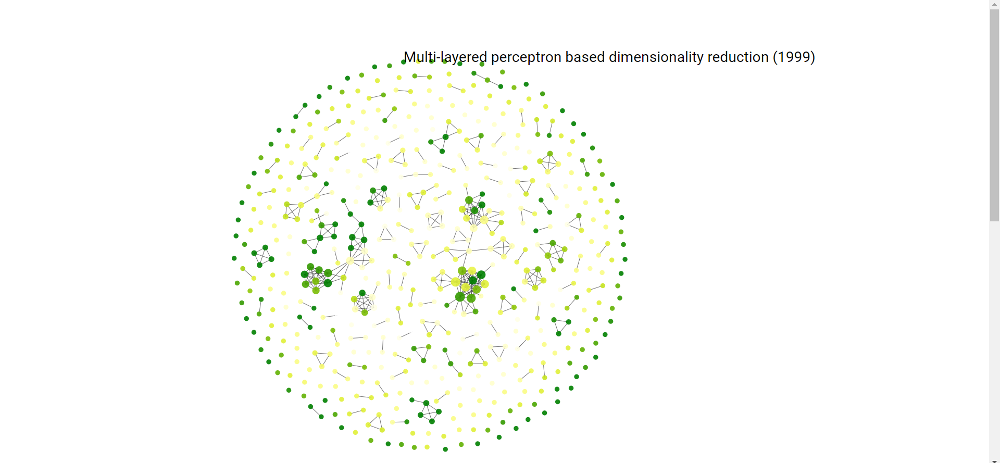

# Force Directed Graph

Force Directed Graph using D3js

A force-directed graph, also known as a spring-embedder graph layout, is a method for visualizing graphs in two or three dimensions. It aims to position the nodes of a graph in a way that minimizes the visual clutter and improves the understanding of the underlying connections.

The force-directed graph layout is based on a physical simulation where the nodes of the graph are represented as particles that interact with each other through attractive and repulsive forces. The layout algorithm iteratively adjusts the positions of the nodes based on these forces until an equilibrium state is reached.

Page Link: https://dhyeydoshi.github.io/Force-Directed-Graph/network.html
